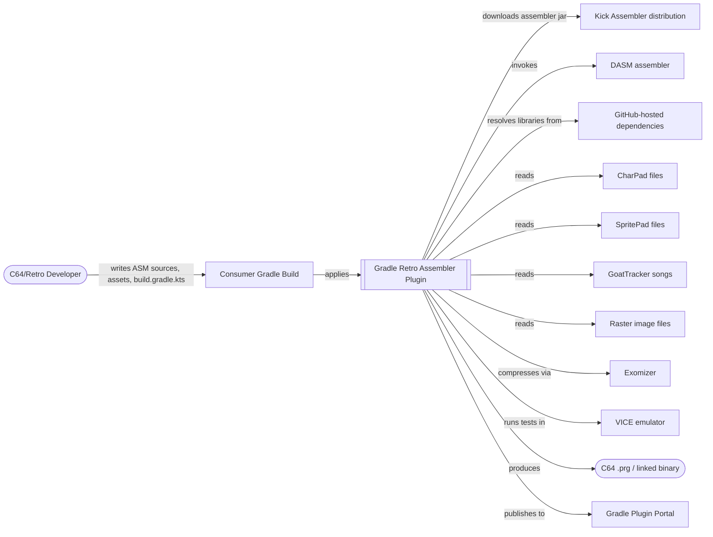

# 3. Context and Scope

## 3.1 Business Context

The plugin sits between a consumer's Gradle build and a set of external retro-computing tools and services. The developer authors assembly sources and asset files (graphics, music) in their project; the plugin turns those into a runnable/tested C64 binary.



**External partners:**

| Partner | Direction | Nature of interaction |
|---------|-----------|------------------------|
| Retro/demoscene developer | inbound | Authors DSL configuration (`build.gradle.kts`), ASM sources, and asset files consumed by the plugin |
| Kick Assembler distribution | outbound | Downloaded JAR (version-pinned), invoked as an assembler subprocess/library call |
| DASM | outbound | Invoked as an external assembler process (`compilers:dasm`) |
| GitHub (dependency source) | outbound | HTTP(S) source for downloadable library/asset dependency archives (`dependencies` domain) |
| CharPad / SpritePad / GoatTracker files | inbound | Binary asset files produced by third-party retro editing tools, parsed by `processors:*` |
| VICE emulator | outbound | Invoked as an external process to execute 64spec test binaries and report results |
| Exomizer | outbound | Invoked to compress linked binaries/segments (`crunchers:exomizer`) |
| Gradle Plugin Portal | outbound | Publish target for released plugin versions |

## 3.2 Technical Context

At the technical level, the plugin is a set of Gradle Kotlin classes (tasks, extensions, Workers API actions) loaded into the *consumer's* Gradle daemon process. It has no server component and no network listener of its own; all "external system" interaction is either file I/O, HTTP downloads, or spawning external tool processes.

```mermaid
flowchart TB
    subgraph ConsumerBuild["Consumer's Gradle Build (JVM process / Gradle daemon)"]
        Ext[RetroAssemblerPluginExtension /\nFlowsExtension / PreprocessingExtension]
        Tasks[Plugin Tasks:\nresolveDevDeps, downloadDeps,\npreprocess, asm, asmSpec, test,\nflows*, build, clean]
        Ext --> Tasks
    end

    FS[(Project file system:\nsources, assets, build/ output)]
    HTTP[[HTTP(S): GitHub releases,\nKick Assembler distribution]]
    Proc[[External processes:\nDASM, VICE, Exomizer, gt2reloc]]

    Tasks <--> FS
    Tasks -- file download --> HTTP
    Tasks -- process invocation --> Proc
```

**Interface summary:**

| Interface | Protocol/Mechanism | Used by |
|-----------|---------------------|---------|
| DSL configuration | Gradle Kotlin DSL (`RetroAssemblerPluginExtension`, `FlowsExtension`, `PreprocessingExtension`) | All domains, wired in `RetroAssemblerPlugin.apply` |
| File system | Java NIO / Gradle `Project` file APIs | Every domain — inputs (sources, assets) and outputs (`build/`) |
| Dependency/tool download | HTTPS via `shared:filedownload.FileDownloader` | `dependencies`, `compilers:kickass` (Kick Assembler jar) |
| External process invocation | `ProcessBuilder`/Gradle `ExecOperations` in outbound adapters | `compilers:dasm`, `emulators:vice`, `crunchers:exomizer`, `processors:goattracker` (gt2reloc) |
| Plugin Portal publication | Gradle `maven-publish` + `com.gradle.plugin-publish` | `infra/gradle`, triggered by `.github/workflows/publish.yml` |

All external systems named above appear in the [Glossary](12_glossary.md).
