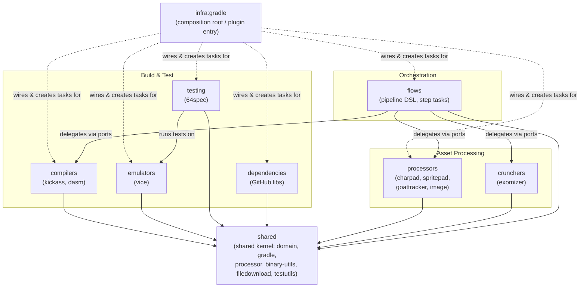

# 5. Building Block View

This section decomposes the system into its static building blocks. Level 1 shows the bounded contexts (domains) and their relationships; Level 2 documents each context's hexagon internals (use cases, ports, adapters) on a dedicated page.

## 5.1 Level 1 — Bounded Contexts

The plugin is organized as a set of **bounded contexts** (domains), each following the hexagonal (ports & adapters) architecture. The `infra:gradle` module is the composition root: it wires every domain together via manual constructor injection (see [§6 Runtime View](06_runtime_view.md) and [§8 Crosscutting Concepts](08_crosscutting_concepts.md)). The `flows` context is an **orchestrator** that delegates to processor, cruncher, and compiler contexts through its own domain ports.

**Relationships:**

- **`infra:gradle` → all domains** — the plugin module holds every domain as a `compileOnly` dependency and instantiates use cases + adapters in `RetroAssemblerPlugin.afterEvaluate`. It owns no business logic (see the `compileOnly` rule in [`infra.md`](building-blocks/infra.md)).
- **`flows` → processors / crunchers / compilers** — `flows` defines its own domain ports (`CharpadPort`, `ExomizerPort`, `AssemblyPort`, …) and delegates to the underlying domains through out-adapters, keeping the orchestrator decoupled from each processor's internals.
- **`testing:64spec` → `emulators:vice`** — the 64spec runner drives tests through the VICE emulator use case.
- **all domains → `shared`** — every context depends on the shared kernel for value types, exceptions, Gradle DSL helpers, and streaming processor abstractions.

### Bounded context → Gradle module mapping

Every module declared in [`settings.gradle.kts`](../../settings.gradle.kts) is mapped to exactly one bounded context below. No module is unmapped.

| Bounded context | Gradle modules | Level-2 page |
|-----------------|----------------|--------------|
| **infra** | `:infra:gradle` | [infra.md](building-blocks/infra.md) |
| **shared** | `:shared:domain`, `:shared:filedownload`, `:shared:gradle`, `:shared:binary-utils`, `:shared:processor`, `:shared:testutils` | [shared.md](building-blocks/shared.md) |
| **flows** | `:flows`, `:flows:adapters:in:gradle`, `:flows:adapters:out:gradle`, `:flows:adapters:out:charpad`, `:flows:adapters:out:spritepad`, `:flows:adapters:out:image`, `:flows:adapters:out:goattracker`, `:flows:adapters:out:exomizer` | [flows.md](building-blocks/flows.md) |
| **compilers** | `:compilers:kickass`, `:compilers:kickass:adapters:in:gradle`, `:compilers:kickass:adapters:out:gradle`, `:compilers:kickass:adapters:out:filedownload`, `:compilers:dasm`, `:compilers:dasm:adapters:out:gradle` | [compilers.md](building-blocks/compilers.md) |
| **emulators** | `:emulators:vice`, `:emulators:vice:adapters:out:gradle` | [emulators.md](building-blocks/emulators.md) |
| **testing** | `:testing:64spec`, `:testing:64spec:adapters:in:gradle` | [testing.md](building-blocks/testing.md) |
| **dependencies** | `:dependencies`, `:dependencies:adapters:in:gradle`, `:dependencies:adapters:out:gradle` | [dependencies.md](building-blocks/dependencies.md) |
| **processors** | `:processors:goattracker` (+ `:adapters:in:gradle`, `:adapters:out:gradle`), `:processors:spritepad` (+ `:adapters:in:gradle`), `:processors:charpad` (+ `:adapters:in:gradle`), `:processors:image` (+ `:adapters:in:gradle`, `:adapters:out:png`, `:adapters:out:file`) | [processors.md](building-blocks/processors.md) |
| **crunchers** | `:crunchers:exomizer`, `:crunchers:exomizer:adapters:in:gradle` | [crunchers.md](building-blocks/crunchers.md) |
| **doc** | `:doc` (documentation module; no production code) | — |

> **Note:** `crunchers` is a first-class bounded context in code but is missing from the older `doc/kb/domain.md` notes. This gap is recorded in [§11 Risks & Technical Debt](11_risks_and_technical_debt.md).

## 5.2 Level 2 — Per-domain hexagons

Each bounded context is documented on its own page: purpose, use-case inventory, port table (port → implementing adapter → path), inbound/outbound adapter details, and a Mermaid hexagon diagram (in-adapter → use case → port → out-adapter).

- [compilers](building-blocks/compilers.md) — Kick Assembler and DASM compilation
- [dependencies](building-blocks/dependencies.md) — GitHub library resolution/download
- [emulators](building-blocks/emulators.md) — VICE emulator control
- [testing](building-blocks/testing.md) — 64spec test execution
- [processors](building-blocks/processors.md) — CharPad, SpritePad, GoatTracker, image asset processing
- [crunchers](building-blocks/crunchers.md) — Exomizer compression
- [flows](building-blocks/flows.md) — pipeline DSL orchestrator
- [shared](building-blocks/shared.md) — shared kernel
- [infra](building-blocks/infra.md) — plugin composition root
