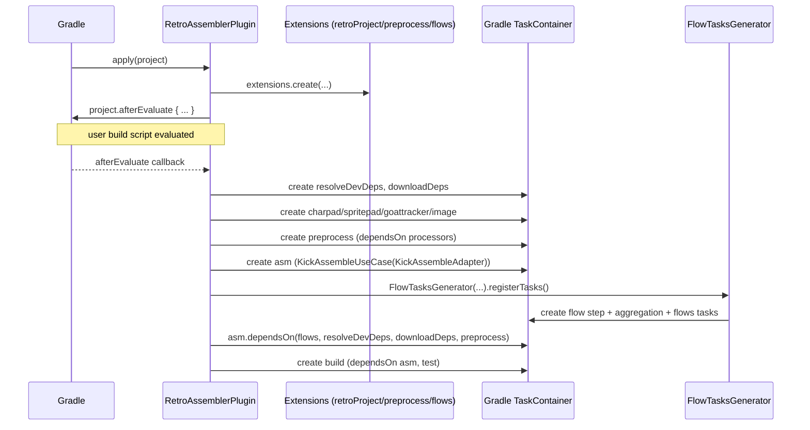
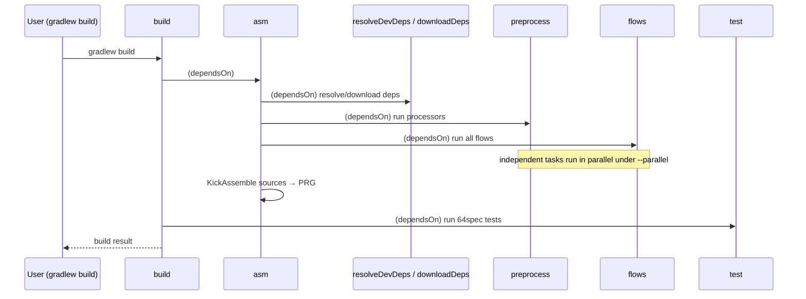
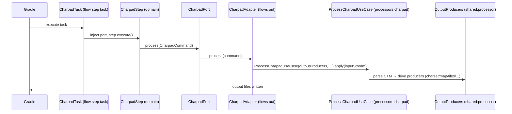
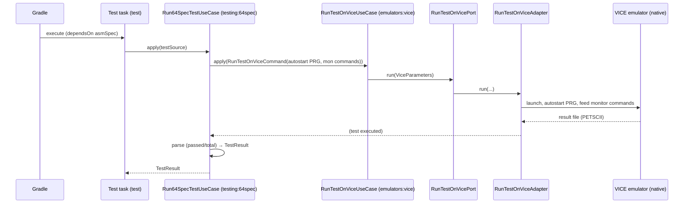
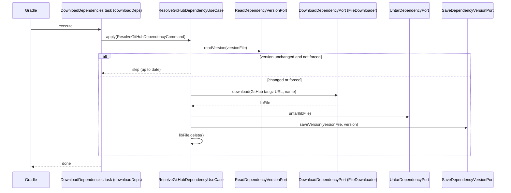

# 6. Runtime View

This section documents the architecturally significant runtime scenarios as Mermaid sequence diagrams. Every participant maps to a real class named in [§5 Building Block View](05_building_block_view.md).

## 6.1 Plugin application & wiring

When Gradle applies the plugin, `RetroAssemblerPlugin.apply` registers the DSL extensions immediately, then defers all task creation and dependency-injection wiring to `afterEvaluate` (so the user's `retroProject { }`, `preprocess { }`, and `flows { }` configuration is fully read first).

## 6.2 Full build lifecycle

Running `build` triggers the whole graph. Preprocessing (asset processing + flows), dependency resolution, and dev-dependency download all complete before assembly; assembly and spec/test complete before `build`.

## 6.3 Flow execution with port delegation

A flow step (here a CharPad step) runs as a dedicated Gradle task. The step task injects the flows-owned port, calls `step.execute()`, and the out-adapter bridges into the `processors:charpad` context — the orchestrator never touches the processor internals directly.

## 6.4 64spec test run via VICE

The `test` task composes contexts: `Run64SpecTestUseCase` (testing) wraps `RunTestOnViceUseCase` (emulators), which drives the native VICE process through its adapter, then parses the emulator's PETSCII result file.

## 6.5 Dependency resolution / download

`downloadDeps` runs `ResolveGitHubDependencyUseCase` per configured dependency. It reads the recorded version and skips the download entirely when it already matches (unless `force`); otherwise it downloads the GitHub archive, untars it, and records the new version.

