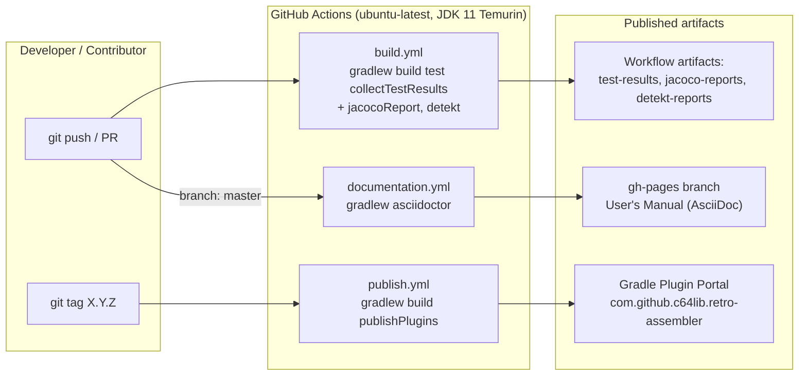
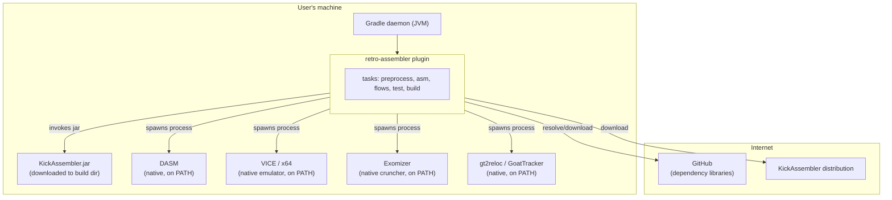

# 7. Deployment View

This section describes where the plugin's artifacts live and run: how the plugin is distributed, which CI pipelines produce and publish it, and what must be present on a developer's machine at build time. Because this is a Gradle *plugin* (not a running service), "deployment" means **artifact distribution and the runtime environment of a user's build**, not a server topology.

## 7.1 Distribution and CI infrastructure

The plugin is built and released entirely through GitHub Actions; there is no manual release step. Three workflows under [`.github/workflows/`](../../.github/workflows/) cover the lifecycle.

| Workflow | Trigger | What it does | Output |
|----------|---------|--------------|--------|
| [`build.yml`](../../.github/workflows/build.yml) | push to `main`/`master`/`develop`, version branches, and **any** PR | `./gradlew build test collectTestResults`, then `jacocoReport detekt --continue` | Uploads `test-results`, `jacoco-reports`, `detekt-reports` as workflow artifacts |
| [`publish.yml`](../../.github/workflows/publish.yml) | push of a **semver tag** (`X.Y.Z` or `X.Y.Z-*`) | `./gradlew build publishPlugins` with `gradle.publish.key`/`secret` from repository secrets, passing the tag as `-Ptag` | Publishes to the **Gradle Plugin Portal** |
| [`documentation.yml`](../../.github/workflows/documentation.yml) | push to `master` | `./gradlew asciidoctor` | Deploys `doc/build/docs/asciidoc` to the **`gh-pages`** branch |

> **Scope note:** This arc42 set is Markdown + Mermaid and renders directly on GitHub; it is **not** part of the `documentation.yml` AsciiDoctor → gh-pages pipeline (see [§9](09_architecture_decisions.md) and [PLAN-0002](../../plans/PLAN-0002_arc42-technical-documentation.md)). Only the User's Manual (`doc/index.adoc`) is published to gh-pages.

The version comes from `gradle.properties` / the pushed tag; the published coordinates are configured in [`infra/gradle/build.gradle.kts`](../../infra/gradle/build.gradle.kts) (plugin id `com.github.c64lib.retro-assembler`).

## 7.2 Runtime environment of a consuming build

Once published, the plugin is applied by an end user in their own Gradle build. It runs inside the **user's Gradle daemon** and orchestrates external native tools it does not bundle — it either downloads them or expects them on `PATH`.

| Runtime element | Placement | How it is provided |
|-----------------|-----------|--------------------|
| Plugin code | User's Gradle daemon (JVM) | Resolved from the Gradle Plugin Portal |
| Kick Assembler | User's build directory | **Downloaded** by the `dependencies` context on demand (`DownloadKickAssemblerUseCase`) — not a native install |
| DASM | User's machine | Native binary expected on `PATH` |
| VICE (`x64`) | User's machine | Native emulator expected on `PATH`; used by `emulators:vice` for 64spec test runs |
| Exomizer | User's machine | Native cruncher expected on `PATH`; invoked by `crunchers:exomizer` / flows command steps |
| gt2reloc / GoatTracker | User's machine | Native tool for `processors:goattracker` |
| GitHub-hosted libraries | Internet | Resolved by `dependencies` (`ResolveGitHubDependencyUseCase`) |

The runtime *interactions* with these tools (who invokes what, in which order) are shown as sequence diagrams in [§6 Runtime View](06_runtime_view.md); the external systems themselves are catalogued in [§3 Context and Scope](03_context_and_scope.md) and defined in the [§12 Glossary](12_glossary.md).
