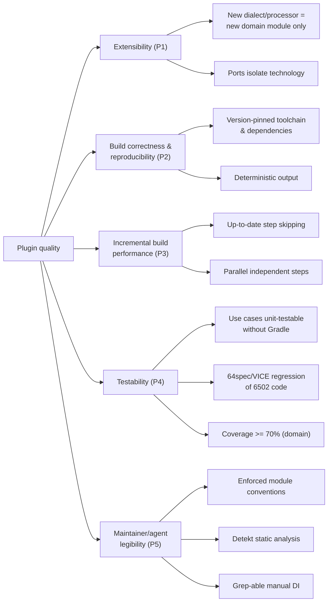

# 10. Quality Requirements

This section refines the quality goals from [§1.2](01_introduction_and_goals.md#12-quality-goals) into a quality tree and concrete, testable scenarios. The top-level goals and their priority order come from §1.2; here they are decomposed into measurable characteristics and example scenarios that make "good enough" verifiable.

## 10.1 Quality tree

## 10.2 Quality scenarios

Each scenario is a stimulus → expected response pair that can be checked against the codebase or CI.

| # | Quality goal | Scenario (stimulus) | Expected response |
|---|--------------|---------------------|-------------------|
| Q1 | Extensibility | A contributor adds support for a new assembler dialect | A new `compilers:<dialect>` module is created following the standard hexagon shape and registered `compileOnly` in `infra:gradle`; **no existing domain module is modified** except the wiring in `RetroAssemblerPlugin`. |
| Q2 | Extensibility | A new asset processor format must be supported | A new `processors:<format>` module with its own use case(s), port(s), and adapters is added; existing processors are untouched. |
| Q3 | Build correctness | The same project is built on two machines / CI | Output binaries are identical: the Kick Assembler jar is version-pinned and downloaded (`DownloadKickAssemblerUseCase`), and dependencies are resolved to pinned versions (`ResolveGitHubDependencyUseCase`). |
| Q4 | Incremental performance | A build re-runs with only one source asset changed | Only the flow steps whose declared `inputs` changed re-execute; unchanged steps report `UP-TO-DATE` via Gradle's up-to-date check (see [§8.6](08_crosscutting_concepts.md#86-parallel-execution-and-incremental-builds)). |
| Q5 | Incremental performance | Independent flow steps exist and `--parallel` is enabled | Gradle runs the independent steps concurrently, driven by the input/output relationships derived in `FlowTasksGenerator`. |
| Q6 | Testability | A change is made to a use case | The use case can be unit-tested directly (JUnit) without instantiating a Gradle `Project`, because all technology is behind ports. |
| Q7 | Testability | A consumer wants to regression-test their 6502 code | 64spec specs run inside VICE via `Run64SpecTestUseCase` / `RunTestOnViceUseCase`, failing the build on a spec failure. |
| Q8 | Testability | CI runs on a PR | `build.yml` runs tests plus `jacocoReport` and `detekt`; aggregated coverage is expected to meet the **≥70% domain / ≥50% infra** targets (see [`CLAUDE.md`](../../CLAUDE.md) "Coverage Targets"). |
| Q9 | Legibility | An AI agent is asked to add a capability | The enforced conventions (`*UseCase.kt` + `apply`, ports, `adapters/in`/`adapters/out`, `compileOnly` registration) documented in `CLAUDE.md` and this arc42 set let the agent place and test the change correctly. |

## 10.3 How these are measured

- **Coverage**: JaCoCo aggregated report (`./gradlew jacocoReport`), target ≥70% across measured domain modules, ≥50% for infra/test-utility modules; enforced via `verifyCodeCoverage`.
- **Static analysis**: Detekt (`./gradlew detekt`) in warning mode, with complexity limits (cognitive complexity < 15, method length < 60, class length < 600) configured in `detekt.yml`.
- **Correctness**: the full `./gradlew build test` suite in CI on every push/PR.
- **Extensibility & legibility**: not automatically measured — upheld by the architecture (§4, §8) and reviewed against the module conventions.
