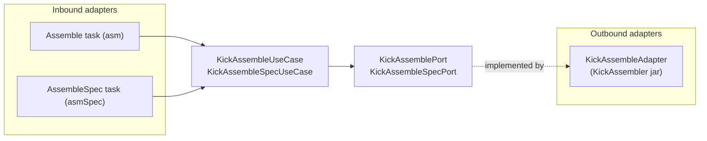

# Building Block: compilers

[← Back to §5 Building Block View](../05_building_block_view.md)

## Purpose

The `compilers` context turns assembly source into binary artifacts (PRG and related formats) for MOS 65xx targets. It contains two independent sub-domains:

- **`compilers:kickass`** — the primary dialect: [Kick Assembler](../12_glossary.md). Also owns downloading the KickAssembler jar as a dev dependency, spec (test) assembly, and build-artefact cleanup.
- **`compilers:dasm`** — the [DASM](../12_glossary.md) dialect, driven as an external command-line tool.

## Use cases

| Use case | Sub-domain | `apply` payload → result | Responsibility |
|----------|-----------|--------------------------|----------------|
| `KickAssembleUseCase` | kickass | `KickAssembleCommand` → `Unit` | Assemble a source file into the configured output format |
| `KickAssembleSpecUseCase` | kickass | spec command → `Unit` | Assemble a 64spec test source for emulator execution |
| `DownloadKickAssemblerUseCase` | kickass | download command → `Unit` | Download the KickAssembler jar (if the version changed) |
| `GenerateKickAssSourceUseCase` | kickass | source-gen payload | Generate KickAss source fragments |
| `CleanBuildArtefactsUseCase` | kickass | pattern → `Unit` | Delete build artefacts matching a glob |
| `DasmAssembleUseCase` | dasm | `DasmAssembleCommand` → `Unit` | Assemble a source file via the DASM CLI |

## Ports

| Port | Direction | Implementing adapter | Path |
|------|-----------|----------------------|------|
| `KickAssemblePort` | out | `KickAssembleAdapter` | `compilers/kickass/adapters/out/gradle/.../KickAssembleAdapter.kt` |
| `KickAssembleSpecPort` | out | `KickAssembleSpecAdapter` | `compilers/kickass/adapters/out/gradle/.../KickAssembleSpecAdapter.kt` |
| `DownloadKickAssemblerPort` | out | `DownloadKickAssemblerAdapter` | `compilers/kickass/adapters/out/filedownload/.../DownloadKickAssemblerAdapter.kt` |
| `ReadVersionPort` / `SaveVersionPort` | out | `ReadVersionAdapter` / `SaveVersionAdapter` | `compilers/kickass/adapters/out/gradle/...` |
| `DeleteFilesPort` | out | `DeleteFilesAdapter` | `compilers/kickass/adapters/out/gradle/.../DeleteFilesAdapter.kt` |
| `DasmAssemblePort` | out | `DasmAssembleAdapter` | `compilers/dasm/adapters/out/gradle/.../DasmAssembleAdapter.kt` |

## Adapters

**Inbound (kickass, Gradle tasks):** `Assemble` (`asm`), `AssembleSpec` (`asmSpec`), `Clean` (`clean`), `ResolveDevDeps` (`resolveDevDeps`) — in `compilers/kickass/adapters/in/gradle/`. Each Gradle task holds its injected use case and calls `apply` during task execution.

**Outbound (kickass):** `KickAssembleAdapter` invokes the KickAssembler jar via a `CommandLineBuilder`; `DownloadKickAssemblerAdapter` uses the shared `FileDownloader`; version adapters persist the resolved dialect version.

**Outbound (dasm):** `DasmAssembleAdapter` builds a DASM command line via `DasmCommandLineBuilder` and executes it. DASM has **no inbound Gradle adapter of its own** — it is reached only through the `flows` context's `DasmAssemblyPort` (see [flows.md](flows.md)).

## Hexagon

