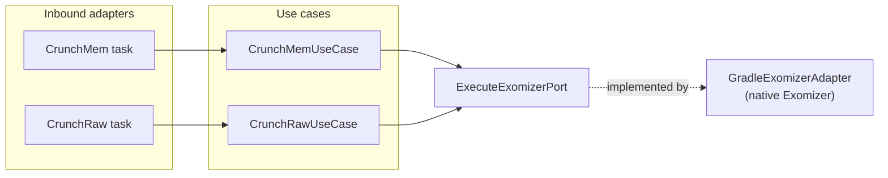

# Building Block: crunchers

[← Back to §5 Building Block View](../05_building_block_view.md)

## Purpose

The `crunchers` context compresses binary artifacts using [Exomizer](../12_glossary.md), a cruncher widely used on the C64. It supports two modes: **raw** compression of arbitrary data and **memory** compression that produces a self-decrunching executable with a load address.

> `crunchers` is a first-class bounded context in code (`crunchers:exomizer`) but is absent from the older `doc/kb/domain.md`. See [§11 Risks & Technical Debt](../11_risks_and_technical_debt.md).

## Use cases

| Use case | `apply` payload → result | Responsibility |
|----------|--------------------------|----------------|
| `CrunchRawUseCase` | `CrunchRawCommand` → `Unit` | Validate inputs and run Exomizer raw compression |
| `CrunchMemUseCase` | `CrunchMemCommand` → `Unit` | Validate inputs + load-address format and run Exomizer memory compression |

Both use cases validate the command (source exists, output directory writable, load-address format) before delegating, raising `ExomizerValidationException` / `ExomizerExecutionException` (see [§8 Crosscutting Concepts](../08_crosscutting_concepts.md)).

## Ports

| Port | Direction | Methods | Implementing adapter | Path |
|------|-----------|---------|----------------------|------|
| `ExecuteExomizerPort` | out | `executeRaw(source, output, options)`, `executeMem(source, output, options)` | `GradleExomizerAdapter` | `crunchers/exomizer/adapters/in/gradle/.../GradleExomizerAdapter.kt` |

## Adapters

**Inbound (Gradle tasks):** `CrunchMem`, `CrunchRaw` — `crunchers/exomizer/adapters/in/gradle/`. These tasks hold the injected use cases and run them.

**Outbound:** `GradleExomizerAdapter` (in the `in/gradle` module) launches the native Exomizer process. When compression is invoked from the [`flows`](flows.md) context, the flows `ExomizerPort` / `ExomizerAdapter` bridges to these use cases.

## Hexagon

