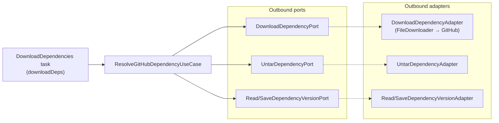

# Building Block: dependencies

[← Back to §5 Building Block View](../05_building_block_view.md)

## Purpose

The `dependencies` context resolves external libraries the user's project depends on, downloading them from GitHub release archives and unpacking them into the work directory. Version tracking avoids re-downloading unchanged dependencies.

## Use cases

| Use case | `apply` payload → result | Responsibility |
|----------|--------------------------|----------------|
| `ResolveGitHubDependencyUseCase` | `ResolveGitHubDependencyCommand` → `Unit` | Download a GitHub `*.tar.gz` archive, untar it, and record its version — skipped when the recorded version already matches (unless `force`) |

## Ports

| Port | Direction | Method | Implementing adapter | Path |
|------|-----------|--------|----------------------|------|
| `DownloadDependencyPort` | out | `download(url, dependencyName): File` | `DownloadDependencyAdapter` | `dependencies/adapters/out/gradle/.../DownloadDependencyAdapter.kt` |
| `UntarDependencyPort` | out | `untar(source)` | `UntarDependencyAdapter` | `dependencies/adapters/out/gradle/.../UntarDependencyAdapter.kt` |
| `ReadDependencyVersionPort` | out | `readVersion(file): String?` | `ReadDependencyVersionAdapter` | `dependencies/adapters/out/gradle/.../ReadDependencyVersionAdapter.kt` |
| `SaveDependencyVersionPort` | out | `saveVersion(file, version)` | `SaveDependencyVersionAdapter` | `dependencies/adapters/out/gradle/.../SaveDependencyVersionAdapter.kt` |

## Adapters

**Inbound:** `DownloadDependencies` Gradle task (`downloadDeps`) — `dependencies/adapters/in/gradle/.../DownloadDependencies.kt`. Iterates the configured dependencies from the plugin extension and calls the use case for each.

**Outbound:** all four adapters live in `dependencies/adapters/out/gradle/`. `DownloadDependencyAdapter` delegates HTTP transfer to the shared `FileDownloader` ([shared.md](shared.md)); the version adapters read/write a per-dependency `version` marker file under the work directory.

## Hexagon

