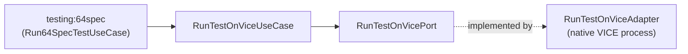

# Building Block: emulators

[← Back to §5 Building Block View](../05_building_block_view.md)

## Purpose

The `emulators` context controls the [VICE](../12_glossary.md) Commodore emulator so tests can run on emulated C64 hardware. It exposes running a program under VICE and querying the emulator version. It is consumed by the [`testing`](testing.md) context.

## Use cases

| Use case | `apply` payload → result | Responsibility |
|----------|--------------------------|----------------|
| `RunTestOnViceUseCase` | `RunTestOnViceCommand` → `Unit` | Launch VICE with an autostart PRG and a monitor-commands file (`ViceParameters`) |
| `QueryForViceVersionUseCase` | executable path → `SemVer` | Query the installed VICE version |

## Ports

| Port | Direction | Method | Implementing adapter | Path |
|------|-----------|--------|----------------------|------|
| `RunTestOnVicePort` | out | `run(parameters: ViceParameters)` | `RunTestOnViceAdapter` | `emulators/vice/adapters/out/gradle/.../RunTestOnViceAdapter.kt` |
| `QueryForViceVersionPort` | out | `queryForVersion(executable): SemVer` | `QueryForViceVersionAdapter` | `emulators/vice/adapters/out/gradle/.../QueryForViceVersionAdapter.kt` |

## Adapters

**Inbound:** none of its own — the emulator is driven from the `testing:64spec` context (see [testing.md](testing.md)).

**Outbound:** both adapters live in `emulators/vice/adapters/out/gradle/` and launch the native VICE process via a `CommandLineBuilder`. `RunTestOnViceAdapter` autostarts the test PRG and feeds monitor commands; `QueryForViceVersionAdapter` parses the version from the emulator's output.

## Hexagon

