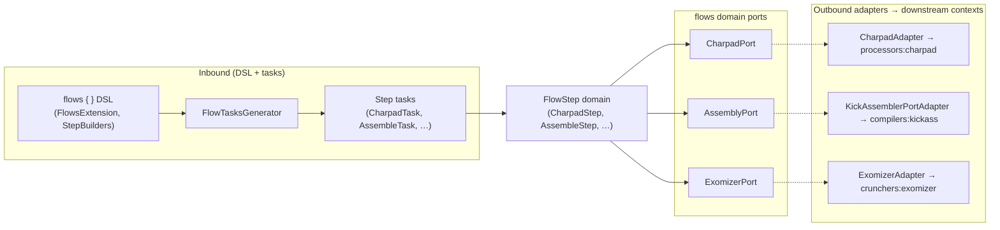

# Building Block: flows

[← Back to §5 Building Block View](../05_building_block_view.md)

## Purpose

The `flows` context is an **orchestrator**: a pipeline DSL that composes processing steps (asset processing, assembly, crunching, arbitrary commands) into named flows with dependency tracking and incremental builds. It does **not** re-implement processing — each step delegates to a processor, cruncher, or compiler context through a `flows`-owned domain port. Independent steps and flows run in parallel under Gradle's `--parallel` mode; ordering is derived from file input/output relationships plus explicit flow `dependsOn` declarations.

See [§8 Crosscutting Concepts](../08_crosscutting_concepts.md) for parallelism/incremental-build details and the `useFrom()`/`useTo()` DSL patterns.

## Domain model

- **`FlowStep`** (base, `flows/src/main/kotlin/.../domain/Flow.kt`) — immutable step with `name`, `inputs`, `outputs`, an injected port, and `execute()` / `validate()` hooks.
- **Step subclasses** (`flows/.../domain/steps/`): `AssembleStep`, `DasmStep`, `CharpadStep`, `SpritepadStep`, `GoattrackerStep`, `ImageStep`, `ExomizerStep`, `CommandStep`.
- **`FlowService`** and **`FlowDependencyGraph`** compute the inter-step / inter-flow dependency graph from artifacts.

## Ports (flows-owned domain ports)

All ports live under `flows/src/main/kotlin/com/github/c64lib/rbt/flows/domain/port/`. Each abstracts a downstream context; the implementing out-adapter bridges to that context's use case.

| Port | Delegates to context | Implementing adapter | Path |
|------|----------------------|----------------------|------|
| `AssemblyPort` | compilers:kickass | `KickAssemblerPortAdapter` | `flows/adapters/in/gradle/.../assembly/KickAssemblerPortAdapter.kt` |
| `DasmAssemblyPort` | compilers:dasm | `DasmPortAdapter` | `flows/adapters/in/gradle/.../assembly/DasmPortAdapter.kt` |
| `CharpadPort` | processors:charpad | `CharpadAdapter` | `flows/adapters/out/charpad/.../CharpadAdapter.kt` |
| `SpritepadPort` | processors:spritepad | `SpritepadAdapter` | `flows/adapters/out/spritepad/.../SpritepadAdapter.kt` |
| `ImagePort` | processors:image | `ImageAdapter` | `flows/adapters/out/image/.../ImageAdapter.kt` |
| `GoattrackerPort` | processors:goattracker | `GoattrackerAdapter` | `flows/adapters/out/goattracker/.../GoattrackerAdapter.kt` |
| `ExomizerPort` | crunchers:exomizer | `ExomizerAdapter` | `flows/adapters/out/exomizer/.../ExomizerAdapter.kt` |
| `CommandPort` | (native process) | `GradleCommandPortAdapter` | `flows/adapters/in/gradle/.../command/GradleCommandPortAdapter.kt` |

> **Note:** the flows ports sit under `domain/port/`, whereas every other context places ports under `usecase/port/`. This inconsistency is recorded in [§11 Risks & Technical Debt](../11_risks_and_technical_debt.md).

## Adapters

**Inbound (DSL & tasks, `flows/adapters/in/gradle/`):**

- **DSL entry:** `FlowsExtension` (registered as the `flows { }` extension), `FlowDsl`, and per-step builders in `dsl/` — `AssembleStepBuilder`, `DasmStepBuilder`, `CharpadStepBuilder`, `SpritepadStepBuilder`, `ImageStepBuilder`, `GoattrackerStepBuilder`, `ExomizerStepBuilder`, `CommandStepBuilder` (the last provides the `useFrom()` / `useTo()` shortcuts).
- **Task generation:** `FlowTasksGenerator` creates one Gradle task per step (`flow{Flow}Step{Step}`), a per-flow aggregation task (`flow{Flow}`), and the top-level `flows` task, wiring dependencies from artifacts + `dependsOn`.
- **Step tasks (`tasks/`):** `BaseFlowStepTask` + `AssembleTask`, `DasmAssembleTask`, `CharpadTask`, `SpritepadTask`, `ImageTask`, `GoattrackerTask`, `ExomizerTask`, `CommandTask` — each injects the relevant port before calling `step.execute()`.

**Outbound (`flows/adapters/out/*`):** the port implementations in the table above. Each translates a flows domain command to the downstream use case (e.g. `CharpadAdapter.process(CharpadCommand)` builds output producers and invokes `ProcessCharpadUseCase`).

## Hexagon

See the flow-execution scenario in [§6 Runtime View](../06_runtime_view.md).
