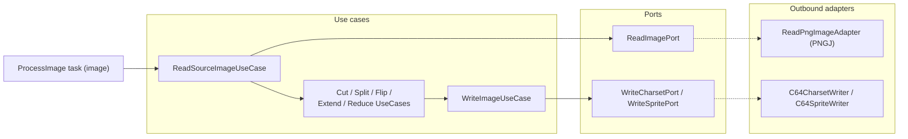

# Building Block: processors

[← Back to §5 Building Block View](../05_building_block_view.md)

## Purpose

The `processors` context converts authoring-tool asset files into C64-ready binary data embeddable in assembly source. It contains four independent sub-domains:

- **`processors:charpad`** — CharPad [CTM](../12_glossary.md) files → charsets, maps, tiles, attributes, colours, materials, metadata
- **`processors:spritepad`** — SpritePad [SPD](../12_glossary.md) files → sprite data
- **`processors:goattracker`** — GoatTracker [SNG](../12_glossary.md) files → relocated [SID](../12_glossary.md) music (via the external `gt2reloc` tool)
- **`processors:image`** — PNG images → C64 charset/sprite data, with cut/split/flip/extend/reduce transforms

The charpad and spritepad sub-domains build on the shared **streaming processor** abstraction (`OutputProducer` / `InputByteStream`, see [shared.md](shared.md)): a parsed input stream is fanned out to a collection of output producers.

## Use cases

| Sub-domain | Use case | `apply` payload → result | Responsibility |
|-----------|----------|--------------------------|----------------|
| charpad | `ProcessCharpadUseCase` | `InputByteStream` → producers | Parse a CTM (v5–v9) and drive the configured output producers |
| spritepad | `ProcessSpritepadUseCase` | `InputByteStream` → producers | Parse an SPD and drive sprite output producers |
| goattracker | `PackSongUseCase` | `PackSongCommand` → `Unit` | Relocate a GoatTracker song via `gt2reloc` |
| image | `ReadSourceImageUseCase` | `ReadSourceImageCommand` → `Image` | Read a PNG into the domain `Image` model |
| image | `WriteImageUseCase` | `WriteImageCommand` → `Unit` | Write an `Image` as C64 charset or sprite data |
| image | `CutImageUseCase` / `CutSourceImageUseCase` | command → `Image` / `Array<Image>` | Cut a region (or tiled regions) from an image |
| image | `SplitImageUseCase` | command → `Array<Image>` | Split an image into sub-images |
| image | `FlipImageUseCase` | command → `Image` | Flip horizontally/vertically |
| image | `ExtendImageUseCase` | command → `Image` | Extend/pad an image |
| image | `ReduceResolutionUseCase` | command → `Image` | Reduce colour resolution |

## Ports

| Sub-domain | Port | Direction | Implementing adapter | Path |
|-----------|------|-----------|----------------------|------|
| goattracker | `ExecuteGt2RelocPort` | out | `ExecuteGt2RelocAdapter` | `processors/goattracker/adapters/out/gradle/.../ExecuteGt2RelocAdapter.kt` |
| image | `ReadImagePort` | out | `ReadPngImageAdapter` | `processors/image/adapters/out/png/.../ReadPngImageAdapter.kt` |
| image | `WriteCharsetPort` | out | `C64CharsetWriter` | `processors/image/adapters/out/file/.../C64CharsetWriter.kt` |
| image | `WriteSpritePort` | out | `C64SpriteWriter` | `processors/image/adapters/out/file/.../C64SpriteWriter.kt` |

> **Note:** charpad and spritepad expose no dedicated out-port — their output side is the shared `OutputProducer` streaming abstraction, wired by the Gradle in-adapters and (for flows) by the flows out-adapters.

## Adapters

**Inbound (Gradle tasks):** `Charpad` (`charpad`) + `CharpadMetaOutput`, `Spritepad` (`spritepad`), `Goattracker` (`goattracker`), `ProcessImage` (`image`) — under each sub-domain's `adapters/in/gradle/`. These tasks build the output-producer collection from the `preprocess` DSL extension and invoke the use case.

**Outbound:** `ReadPngImageAdapter` uses [PNGJ](../12_glossary.md); `C64CharsetWriter` / `C64SpriteWriter` write C64 binary formats; `ExecuteGt2RelocAdapter` launches the native `gt2reloc` process.

> **Note:** `processors:spritepad` uses the package root `com.c64lib.rbt...` rather than the project-standard `com.github.c64lib.rbt...`. This inconsistency is recorded in [§11 Risks & Technical Debt](../11_risks_and_technical_debt.md).

## Hexagon (image sub-domain)

