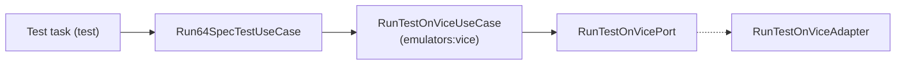

# Building Block: testing

[← Back to §5 Building Block View](../05_building_block_view.md)

## Purpose

The `testing` context runs automated unit tests for assembly code using the [64spec](../12_glossary.md) framework. It assembles a spec, runs it on the [VICE](../12_glossary.md) emulator, and parses the emulator's output into a pass/fail result.

## Use cases

| Use case | `apply` payload → result | Responsibility |
|----------|--------------------------|----------------|
| `Run64SpecTestUseCase` | `testSource: File` → `TestResult` | Run a spec on VICE and parse the `(passed/total)` result from PETSCII output |

`Run64SpecTestUseCase` composes the [`emulators:vice`](emulators.md) context: it wraps a `RunTestOnViceUseCase`, calling it with the assembled PRG and VICE symbol/monitor files, then reads and parses the result file.

## Ports

This context has **no outbound ports of its own** — it reaches emulated hardware indirectly, by delegating to `RunTestOnViceUseCase` (which owns `RunTestOnVicePort`). This is a use-case-composing-use-case relationship rather than a port relationship.

## Adapters

**Inbound (Gradle tasks):** `Test` (`test`) and `TestReport` — in `testing/64spec/adapters/in/gradle/`. The `Test` task holds the injected `Run64SpecTestUseCase` and executes it per spec source; `TestReport` aggregates results.

**Outbound:** none — see Ports above.

## Hexagon

See the full test scenario in [§6 Runtime View](../06_runtime_view.md).
