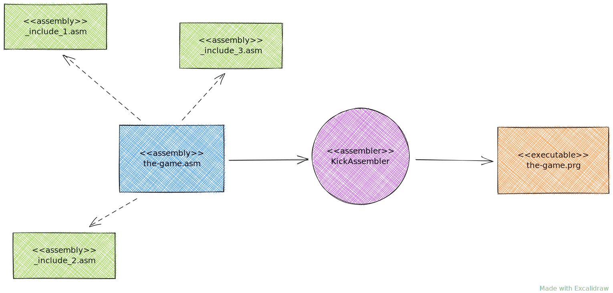
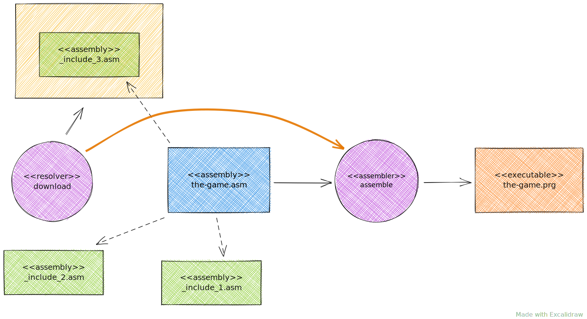
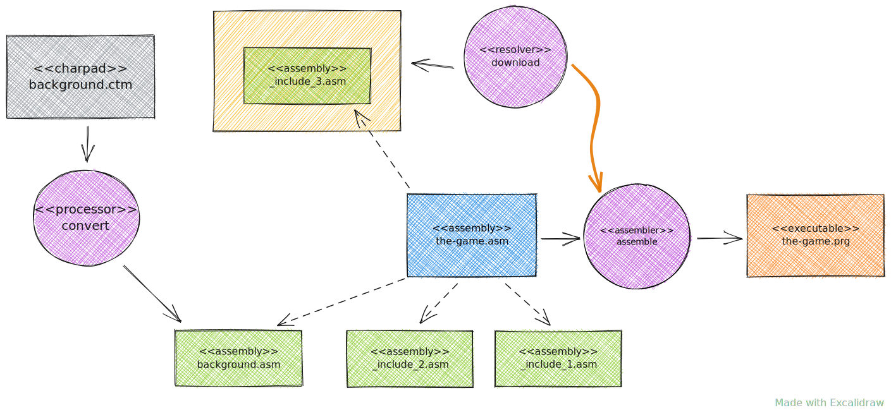

= Processes

== Simple assembling process

In its simplest form we take a single `asm` file (an entry file) and compile it with Assembler (i.e. with KickAssembler) to get an output file (in this case this is an executable `prg` file).
There can be plenty of additional files that are included implicitly to the entry file via `import` directive.
For these "includes" files no separate output files are generated.

== Resolving external dependencies

Include files can be delivered as external dependencies.
In this case these dependencies must be resolved before assembling.
Resolving usually means: downloading them into some volatile place to enable contained `asm` files to be included by project sources.

== Converting resource files into assembly

Third party software can be used to produce meaningful resources such as graphical or musical data.
These resources require further processing in order to be embedded into the assembly program.
Dedicated processors can be used to accomplish this conversion task.
These processors produce `asm` files that can be included into the main program.
Alternatively, processors can produce binary data that can also be embedded into assembly as data blocks.

