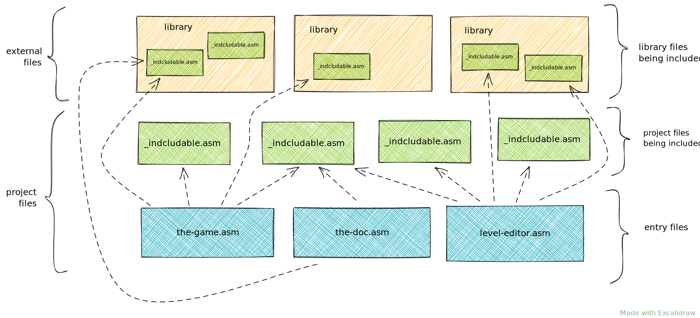

= Overview

== Retro assembler project model

The source model of any retro assembler (MOS 6502 based) project is very simplified.
There is no interim form of compilation process and there is no linker.
The only means to reuse shared code is to use import directive therefore for the project it is sufficient to know all entry point files and assembly them one by one into executables (i.e. PRG files).
All internal dependencies are specified within source files.
All external dependencies must be handled externally (via retro assembler build tool).

