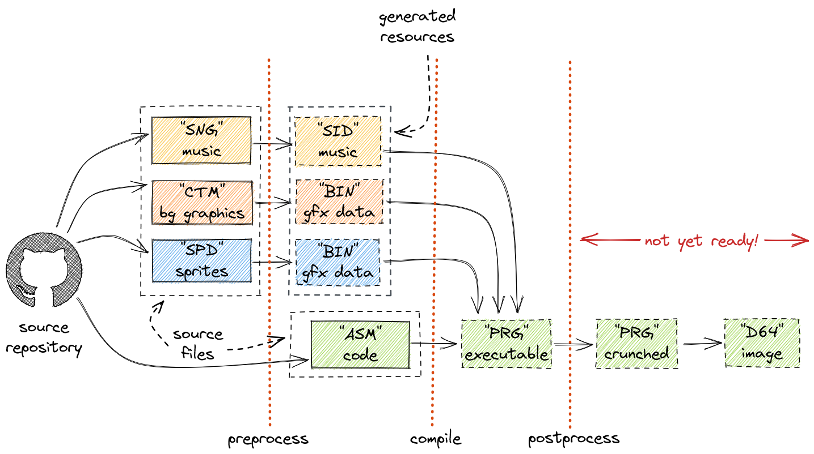
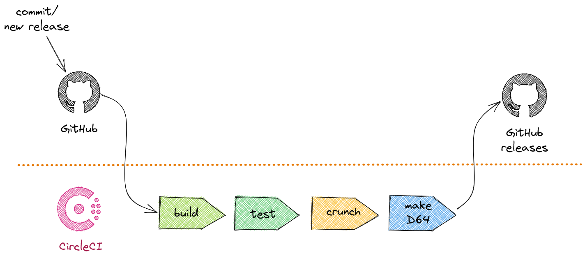
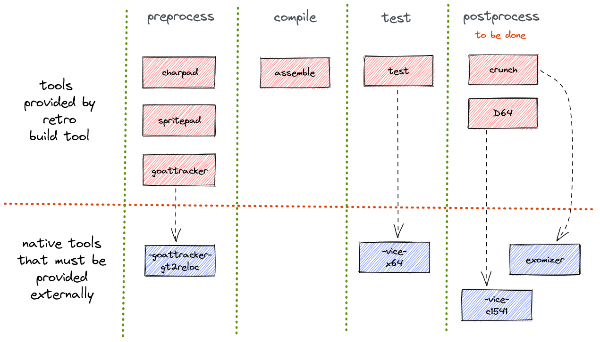

= Retro Build tool: User's Manual
:icons: font
:toc: left
:sectnums:
:stylesheet: clean.css
:source-highlighter: highlight.js
:highlightjs-languages: assembly,kotlin,groovy,bash,yaml
:stem: latexmath
:docinfo:
:actualKickAssVersion: 5.25
:actualDockerVersion: 0.1.7
:actualPluginVersion: 1.6.0

Retro Build Tool brings automation to the C64 software building process.
It is implemented as a Gradle plugin.

Gradle is a universal build tool that is used for automation in IT industry.
It supports Java ecosystem out of the box but is also extensible via plugin system.

This plugin supports Commodore 64 output and KickAssembler only, but there are plans to extend it further.

This is an open source project hosted on https://github.com/c64lib/gradle-retro-assembler-plugin[GitHub].
In case of any problems when working with the plugin, don't hesitate to create an https://github.com/c64lib/gradle-retro-assembler-plugin/issues[issue].
Feel free to fork and create pull requests.

The roadmap for the project is fairly dynamic, but it can be accessed and reviewed at any moment at https://github.com/orgs/c64lib/projects/3/views/6[this place].

== Getting started

=== Installation & requirements

You need Java 11+ in order to use Gradle and the plugin as such.
If you don't have any, or your version is too old (less than 11), go to https://jdk.java.net/[], download and install appropriate version.

If the project you want to build uses Gradle Wrapper (see <<Using Gradle Wrapper>> section for more details), you don't need to install anything more.
It would be then sufficient to enter project directory and type:

[source,bash]
----
gradlew build
----

You can use the following projects for reference:

* https://github.com/maciejmalecki/trex64[]
* https://github.com/c64lib/ctm-viewer[]

If the project does not use Gradle Wrapper, you have to install Gradle by yourself.
It is pretty straightforward, you'll find instructions here: https://gradle.org/install/[].

Having Gradle installed is also needed if you want to author Gradle Wrapper capable projects by yourself.
Please refer <<Using Gradle Wrapper>> for further reading.

=== Functional overview

The idea behind of Retro Build Tool is to provide a complete yet flexible utility that builds an application from sources of different kinds.
Sources are files kept in some sort of source control system, and the tool performs transformations of these files.

Transformations can be any of the following:

* exporting raw binary data out of source files (such as Charpad, Spritepad),
* exporting SID file out of source music file,
* crunching,
* compilation (assembling),
* building D64 floppy disk image or CRT cartridge image.

How does this tool differ from `make`?
Well, in Retro Build Tool we rather declare what we want to do than code how to do it.
This tool builds an abstraction layer around concrete tools and make the whole building process simple and portable.

The Retro Build Tool is Continuous Integration capable.
It is meant to automate release process, as shown in following example.

With Retro Build Tool it is possible to generate executable artifacts and deploy them on demand i.e. as part of GitHub releases.

As for now, the Retro Build Tool is not able to provide all dependencies out of the box.
It depends on some externally available commands (mostly for non-Java based tools) such as:

* Vice C64 emulator (at least 3.7),
* Exomizer,
* GoatTracker 2.

These tools should be installed and available via `PATH` when running Retro Build Tool.
The docker image used for Circle CI builds (see <<CircleCI>>) is already supporting all these tools.
A complete list of external dependencies is presented on the next diagram.

=== Create your first build script
If you have Gradle installed on your machine, you just need to create `build.gradle` file in root folder of your project.
Fill it with following content:

[source,groovy,subs="attributes"]
----
plugins {
    id "com.github.c64lib.retro-assembler" version "{actualPluginVersion}"
}

retroProject {
    dialect = "KickAssembler"
    dialectVersion = "{actualKickAssVersion}"
    libDirs = [".ra/deps/c64lib"]
    srcDirs = ["lib", "spec"]

    // dependencies
    libFromGitHub "c64lib/64spec", "0.7.0pr"
}
----

You can of course adjust all values inside `retroProject` to your needs.

As you can see you don't have to download Retro Assembler Plugin, it will be automatically downloaded and used once `gradle` command is run.
The plugin is published into Plugins portal: https://plugins.gradle.org/plugin/com.github.c64lib.retro-assembler[https://plugins.gradle.org] and can be used as any other Gradle plugin.

=== Launching your build
There are two core tasks that can be used from command line:

* `gradle build` performs assembling process and produces output files (actually `sym` and `prg` files are created
alongside source `asm` files)
* `gradle clean` performs overall cleaning of the project by removing target files (that is `sym` and `prg` files)

If gradle command is issued without any task specified, a `build` task is assumed.
It is also possible to run both of tasks:

[source,bash]
----
gradle clean build
----

This ensures that old files are removed prior assembling process.

=== Using Gradle Wrapper
Gradle Wrapper is a recommended way to distribute sources of your projects.
When Gradle Wrapper is installed in your project, other people do not need to have Gradle installed locally.
Gradle Wrapper takes care on downloading appropriate Gradle version during build and then executing it using `build.gradle` file.
Actually only Java Environment (JDK) is necessary to build such projects.

With Gradle Wrapper build can be run using `gradlew` command:

[source,bash]
----
gradlew clean build
----

or

[source,bash]
----
./gradlew clean build
----

under linux-like OS.

Read how to install Gradle Wrapper in Gradle documentation: https://docs.gradle.org/current/userguide/gradle_wrapper.html[].

== Assembling

Assembling is a core part of the build tool.
The idea behind is that the tool should take care of appropriate assembler binary as well as your project structure and just compile source files into binary with minimal effort of the coder.
This section describes how assembling can be configured and run.

=== Configuration

In order to use assembling part of the build tool you have to specify the `retroProject` section in your build file:

[source,groovy,subs="attributes"]
----
retroProject {
    dialect = "KickAssembler"
    dialectVersion = "{actualKickAssVersion}"
}
----

The minimal amount of information you have to provide is:

dialect:: A type of assembler that you want to use (currently only `KickAssembler` is supported).
dialectVersion:: A version of the selected assembler you want to use. For KickAssembler, see https://github.com/c64lib/asm-ka/releases for list of all available versions.

In this setup, the tool will assemble all files with `asm` extension located in project directory and all subdirectories.
See <<Customizing your build>> section to see how to modify this default behavior.

=== Tasks

There are two general tasks that are in most cases sufficient to build/rebuild an ASM project:

clean:: Erases all generated/assembled files from your project including PRG files.
build:: Performs a complete build of your project (including assembling, running tests and running all processors).

The simplest use case is running from command line:

[source,bash]
----
gradlew clean build
----

The `clean` task above is optional.
You should use it if you want to ensure that all files will be recreated/assembled from scratch.
This is useful for troubleshooting mainly.

Just to run an assembler use `asm` task:

[source,bash]
----
gradlew asm
----

There are two supplementary tasks that are called automatically when `build` task is performed:

resolveDevDeps:: downloads and prepares to use software needed for assembling (i.e. KickAssembler binary)
downloadDeps:: downloads and unzips libraries (dependencies) that are used by your project.

It is also possible to run supplementary tasks manually:

[source,bash]
----
gradle resolveDevDeps downloadDeps
----

Note, that `downloadDeps` and `resolveDevDeps` task will download relevant assets only if version has been changed, or they weren't downloaded earlier.
If, by any reason, you would like to force downloading of these assets, you can use `forceDownload` project flag to do it:

[source,bash]
----
gradle build -PforceDownload=true
----

You can exclude running unit tests if you don't have appropriate Vice version installed but still want to run the build:

[source,bash]
----
gradlew build -x test
----

=== Customizing your build
Certain aspects of assembling task can be customized.
Customization can be done by setting properties in `retroProject` configuration section.

==== Project layout

Project layout means where (in which directories) to look for source files for the assembler to work on.
The build tool allows to specify both the directories and which files to use.

`srcDirs`:: Provides array of directory locations where your source code (`asm` files) resides; default value: `["."]`.
`excludes`:: Provides array of file patterns that matches source files to be excluded from assembling; default value: `[".ra/\**/*.asm"]`.
`includes`:: Provides array of file patterns that contains sources you want to assembly; default value: `["\**/*.asm"]`.

Multiple source directories can be specified:

[source,groovy,subs="attributes"]
----
retroProject {
    dialect = "KickAssembler"
    dialectVersion = "{actualKickAssVersion}"
    srcDirs = ["src", "lib"]
}
----

By default, all files with `.asm` extension located in source directories are included.
You can either specify exact single file to be assembled:

[source,groovy,subs="attributes"]
----
retroProject {
    dialect = "KickAssembler"
    dialectVersion = "{actualKickAssVersion}"
    srcDirs = ["src"]
    includes = ["rex.asm"]
}
----

or include only files located directly in source directories and not in any subdirectories:

[source,groovy,subs="attributes"]
----
retroProject {
    dialect = "KickAssembler"
    dialectVersion = "{actualKickAssVersion}"
    srcDirs = ["src", "lib"]
    includes = ["*.asm"]
}
----

You can also exclude certain files, for instance these starting with `_` (underscore) in the name:

[source,groovy,subs="attributes"]
----
retroProject {
    dialect = "KickAssembler"
    dialectVersion = "{actualKickAssVersion}"
    srcDirs = ["src"]
    excludes = ["**/_*.asm"]
}
----

==== Including external resources

There are certain resources considered as "external" to the project.
In build tool there are:

* external libraries, downloaded by the tool itself and located in `.ra\deps` "magic" directory;
* generated `bin` files containing graphics, maps etc, generated by various <<Processors>>.

These are volatile files (not commited to the SCM) but we really would like to import (include) them in our `asm` files.
For that reason we would like to add certain additional locations to the search path of the assembler.
This can be easily achieved with `libDirs` parameter.

`libDirs`:: Provides array of directory locations where your libraries are downloaded; default value: `[]`.

If you want to use `c64lib` set of ASM libraries and also use <<Charpad exports>> and <<Spritepad exports>> configured to use `build` directory as a output, use following snippet:

[source,groovy,subs="attributes"]
----
retroProject {
    dialect = "KickAssembler"
    dialectVersion = "{actualKickAssVersion}"
    libDirs = [".ra/deps/c64lib", "build/charpad", "build/spritepad"]

    libFromGitHub("c64lib/common", "develop")
    libFromGitHub("c64lib/chipset", "develop")
    libFromGitHub("c64lib/text", "develop")
    libFromGitHub("c64lib/copper64", "develop")
}
----

==== Preprocessor symbols

Some assemblers (like KickAssembler) allow defining symbols that can be used by preprocessor in order to compile certain parts of the software conditionally.
These symbols can be also passed to the Assembler from CLI thus via build tool.

`defines`:: Sets up a list of preprocessor symbols that will de defined during this assembly launch.

Use the following snippet to define `ntsc` and `debug` symbol during assembling:

[source,groovy,subs="attributes"]
----
retroProject {
    dialect = "KickAssembler"
    dialectVersion = "{actualKickAssVersion}"
    defines = ["ntsc", "debug"]
}
----

=== Using external ASM dependencies
If you need to use some library code written in KickAssembler, Retro Gradle Plugin can download them for you automatically.
You just need to specify these dependencies inside your `retroProject` section:

[source,groovy]
----
retroProject {
    libFromGitHub "c64lib/common", "1.0.0"
}
----

Please note, that currently only GitHub is supported as a source for library releases.In future this will be extended.

== Running Unit tests with 64spec
Version 1.0.0 supports now launching unit tests written in KickAssembler.
In order to be able to do so, a Vice 3.7+ must be installed on a machine where tests will be launched.
It is also assumed that `x64sc` command is available on the path.
Also the 64spec library must be added to dependencies, as any other KickAssembler library:

[source,groovy]
----
retroProject {
    libFromGitHub "c64lib/64spec", "0.7.0pr"
}
----

Please note, that original version of 64spec does not work with newer versions of KickAssembler, therefore forked version is used.

By default, Gradle Retro Assembler plugin detects whether there are any tests in your projects and if found it tries to launch them.
It is assumed that tests are located in `spec` directory of project's root (or its
subdirectories) and that they are included in files ended with `spec.asm`.
This default behavior can be customized by assigning new dir name and file masks in `build.gradle`:

[source,groovy]
----
retroProject {
    specDirs = ['tests']
    specIncludes = ['**/*.test.asm']
}
----

The following will reconfigure plugin to seek for tests in `tests` directory and execute each test ended with `test.asm`.

You can change Vice executable from `x64sc` into `x64`, or even change path to the Vice executable completely by using following setting:

[source,groovy]
----
retroProject {
    viceExecutable = 'x64'
}
----

Note, that as for now, the RBT is unable to determine exact version of Vice it is using nor whether to run `x64` or `x64sc` -- the `x64sc` is assumed as default.
Also note, that currently only Vice 3.7 or above are supported.

== Processors

Preprocessors are run before assembling is done to ensure that all intermediate data is prepared beforehand.

There are plenty of preprocessors available in build tool, they are described in subsequent chapters.
To run all of them, use `preprocess` task:

[source,bash]
----
gradle preprocess
----

=== Charpad exports

Retro assembler build tool supports Charpad CTM file format and provides export of the following elements:

* charset,
* charset attributes, colours, screen colours (bitmap only) and materials,
* tile set,
* tile set colours and screen colours (bitmap only),
* maps,
* CTM file meta data.

Currently supported versions of CTM file are 5, 6, 7 and 8.

Charpad processor is a part of preprocessor and is executed before assembling process is started.

Charpad processor can be launched explicitly with following command:

[source,bash]
----
gradle charpad
----

Charpad processor will be executed only if there is at least one `charpad` pipeline defined in `preprocess` section:

[source,groovy]
----
preprocess {
    charpad {
        input = file("src/levels/level1/level-background.ctm")
        outputs {
            charset {
                start = 0
                end = 64
                output = file("src/levels/level1/charset.bin")
            }
        }
    }
}
----

Each pipeline tackles single CTM file.
If you have more than one CTM file in your project, you have to declare multiple pipelines -- one per file.

[source,groovy]
----
preprocess {
    charpad {
        input = file("src/levels/level1/level-background.ctm")
        outputs {
            charset {
                output = file("levels/level1/charset.bin")
            }
        }
    }
    charpad {
        input = file("src/levels/level2/level-background.ctm")
        outputs {
            charset {
                output = file("levels/level2/charset.bin")
            }
        }
    }
}
----

.Elements of charpad pipeline definition
input::
File element defining input file to the pipeline.
It must point to the correct CTM file.

outputs::
Set of outputs defining output files, parameters and transformations.
See <<Outputs>> for details.

useBuildDir::
Whether to use build dir for output files.
Accepts boolean values: `true` (default) or `false`.
If set to `true`, all outputs will be created within `build/charpad` as a parent directory.
If set to `false`, all outputs will be created within project directory as a parent.

ctm8PrototypeCompatibility::
This option should be set to `true` for CTM files saved with Charpad Pro version 3.0 beta to 3.9.
For Charpad Pro v 3.10 or newer, this option should be set to `false` (which is a default value).

[NOTE]
.Note on compatibility flag
====
The reason for this `ctm8PrototypeCompatibility` is that in 3.0 - 3.9 range there were two CTM8 versions supported: CTM8 and CTM8.2.
The version CTM8 becomes quickly obsolete and was retained just for backward compatibility reasons.
It is recommended to migrate all your CMT8 files to a 'real' CTM8 with Charpad 3.10 and don't use this compatibility flag any longer.
====

==== Outputs
The `outputs` section brings extensive configuration capabilities regarding what data are extracted from CTM file.
It is possible to create multiple binary files from single input CTM file.

The following elements can be specified (multiple times) under `outputs`:

* `charset`,
* `charsetAttributes`,
* `charsetColours`,
* `charsetScreenColours`,
* `tiles`,
* `tileColours`,
* `tileScreenColours`,
* `map`,
* `meta`.

===== Charset
Outputs charset data out of the CTM file.
Each character is defined by 8 bytes.
The layout of the data follows the layout scheme of the C64 character generator.

.Elements of charset output
start:: Number of the first character to be exported (zero-based, default: 0).
end:: Number of the character that follows the last one to be exported (zero-based, default 65536).
output:: Output file or transformations (see: <<Output transformations>>).

NOTE: The `start` and `end` values are specified in character positions, not bytes.

===== Charset attributes
Outputs specific attributes of the characters out of the CTM file.

Each character attribute is encoded in single byte:

* high nybble contains material code,
* low nybble contains colour value.

.Elements of charset attributes
start:: Number of the first character attribute to be exported (zero-based, default: 0).
end:: Number of the character attribute that follows the last one to be exported (zero-based, default 65536).
output:: Output file or transformation (see: <<Output transformations>>).

As both material and colour information is packed into single byte, the <<Nybbler>> transformer can be used to separate this data into two output files.

===== Charset colours
Outputs primary colours of given charset.
This is basically the same color as produced by <<Charset attributes>> except it does not contain material information.

.Elements of charset colours
start:: Number of the first character colour to be exported (zero-based, default: 0).
end:: Number of the character colour that follows the last one to be exported (zero-based, default 65536).
output:: Output file or transformation (see: <<Output transformations>>).

===== Charset screen colours
Output colours `01` and `02` of given charset.
This producer makes sense for bitmap modes and works only with CTM files of Charpad 3.0 or higher.
Colours are packed into nybbles in exactly the way the VIC-II expects to see them in screen memory.

.Elements of charset screen colours
start:: Number of the first character screen colour to be exported (zero-based, default: 0).
end:: Number of the character screen colour that follows the last one to be exported (zero-based, default 65536).
output:: Output file or transformation (see: <<Output transformations>>).

===== Charset materials
Output material codes of given charset.
Material code is encoded into single byte taking its low nybble.

.Elements of charset materials
start:: Number of the first character material to be exported (zero-based, default: 0).
end:: Number of the character material that follows the last one to be exported (zero-based, default 65536).
output:: Output file or transformation (see: <<Output transformations>>).

===== Tiles
Outputs tile set in case this one exist in CTM file.

If tile set exists, each tile consists of latexmath:[w_T \times h_T \times 2] bytes, where latexmath:[w_T] stands for tile width and latexmath:[h_T] stands for tile height.

It is noteworthy, that each character of the tile is defined by two bytes, as CTM file supports up to 65526 characters. To filter out high-byte values, use <<Interleaver>>.

.Elements of tiles output
start:: Number of the first tile to be exported (zero-based, default: 0).
end:: Number of the tile that follows the last one to be exported (zero-based, default: 65536).
output:: Output file or transformations (see: <<Output transformations>>).

===== Tile colours
Outputs tile colours information if the tile set is included in CTM file.

Colour of the tile is specified by single byte.

.Elements of tile colours output
start:: Number of the first tile colour data to be exported (zero-based, default: 0).
end:: Number of the tile colour data that follows the last one to be exported (zero-based, default: 65536).
output:: Output file or transformations (see: <<Output transformations>>).

===== Tile screen colours

Outputs tile screen colours information if the tile set is included in CTM file.

This specifies colours `01` and `10` and makes sense only for bitmap modes.
Colours are packed into single byte using two nybbles.
This data is produced only when CTM file is created with Charpad 3.0 or higher.

.Elements of tile screen colours output
start:: Number of the first tile screen colour data to be exported (zero-based, default: 0).
end:: Number of the tile screen colour data that follows the last one to be exported (zero-based, default: 65536).
output:: Output file or transformations (see: <<Output transformations>>).

===== Tile tags

Outputs tile tags if the tile set is included in CTM file.

Each tag is a byte of information assigned to each tile in the tileset.

.Elements of tile tags output
start:: Number of the first tile tag data to be exported (zero-based, default: 0).
end:: Number of the tile tag data that follows the last one to be exported (zero-based, default: 65536).
output:: Output file or transformation (see: <<Output transformations>>).

===== Map
Outputs map data out of the CTM file.

Each cell of map data consists of 2 bytes and defines either the tile or the character, depending on the CTM mode.
This output supports exporting rectangular portions of the map out-of-the-box.
If you need to export several portions of the same input file (i.e. for multiple levels sharing the same character and tile set information), map output can be repeated for each of the portion.

.Elements of the map output
left:: Left edge of the map being exported (zero-based, default: 0).
top:: Top edge of the map being exported (zero-based, default: 0).
right:: Right edge (exclusive) of the map being exported (zero-based, default: 65536).
bottom:: Bottom edge (exclusive) of the map being exported (zero-based, default: 65536).
output:: Output file or transformations (see: <<Output transformations>>).

===== Meta
Outputs CTM file meta data such as colour numbers, screen mode, colouring mode in specified Assembly format.
Such meta data file can be included into ASM code for further usage.
Meta data are exported in form of Assembly labels.

.Elements of the meta output
`dialect`:: Assembly dialect to be used. Currently only KickAssembler is supported. This property is mandatory.
`prefix`:: Prefix for each label being exported. Default value: no prefix / empty.
`namespace`:: Optional namespace to be declared for exported file. Default: empty / no namespace.
`includeVersion`:: Whether to generate label with CTM file version. Default: false.
`includeBgColours`:: Whether to generate labels with background colours. Default: true.
`includeCharColours`:: Whether to generate labels with colours. Default: true.
`includeMode`:: Whether to generate labels with screen mode and colouring method. Default: false.

[source,groovy]
.Example of meta data output.
----
meta {
  dialect = "KickAssembler"
  includeMode = true
  namespace = "c64lib"
  prefix = "logo_"
  output = file("charset/game-logo-meta.asm")
}
----

The example from above results in generated the following meta data source file:

[source]
----
/*
  This file is generated by Charpad processor of Retro Build Tool.

  DO NOT MODIFY THIS FILE!
*/

.filenamespace c64lib

.label logo_backgroundColour0 = 0
.label logo_backgroundColour1 = 0
.label logo_backgroundColour2 = 1
.label logo_backgroundColour3 = 12

.label logo_charColour = 13

.label logo_colouringMethod = 2
.label logo_screenMode = 0
----

==== Complete example

[source,groovy]
----
preprocess {
    charpad {
        useBuildDir = true
        input = file("src/levels/level1/background.ctm")
        outputs {
            charset {
                // complete charset
                start = 0
                end = 256
                output = file("levels/level1/charset.bin")
            }
            tiles {
                end = 64
                interleaver {
                    output = file("levels/level1/tiles.bin")
                }
                // only 256 characters, hi byte can be ignored
                interleaver {
                }
            }
            tileColours {
                output = file("levels/level1/colors.bin")
            }
            // one map is used for three levels
            map {
                right = 135
                interleaver {
                    output = file("levels/level1/map-1.bin")
                }
                // only 64 tiles, hi byte can be ignored
                interleaver {
                }
            }
            map {
                left = 135
                right = 260
                interleaver {
                    output = file("levels/level1/map-2.bin")
                }
                interleaver {
                }
            }
            map {
                left = 260
                interleaver {
                    output = file("levels/level1/map-3.bin")
                }
                interleaver {
                }
            }
        }
    }
}
----

=== Spritepad exports

Retro assembler build tool supports Spritepad SPD file format and provides export of the sprites definition only.
As for now, export of animation and colours is not supported.

Currently supported versions of SPD file are 4 and 5.

Spritepad processor is a part of preprocessor and is executed before assembling process is started.

Spritepad processor can be launched explicitly with following command:

[source,bash]
----
gradle spritepad
----

Spritepad processor will be executed only if there is at least one `spritepad` pipeline defined in `preprocess` section:

[source,groovy]
----
preprocess {
    spritepad {
        input = file("src/sprites/dino.spd")
        outputs {
            sprites {
                output = file("src/sprites/dino.bin")
            }
        }
    }
}
----

By default, all sprites defined in SPD file are exported.
Each sprite is exported as 64 bytes - first 63 bytes contains sprite definition, the last byte contains sprite attribute, which is identical to the attribute byte of Spritepad SPD file specification.

It is possible to export a subset of sprites for given SPD file:

[source,groovy]
----
preprocess {
    spritepad {
        input = file("src/sprites/dino.spd")
        outputs {
            sprites {
                start = 1
                end = 2
                output = file("src/sprites/dino.bin")
            }
        }
    }
}
----

The example above exports only second (1) and third (2) sprite definition.
Omit `start` to start from beginning, omit `end` to export till the end of the file.

=== Goat Tracker exports
[WARNING]
.Experimental feature
====
This feature should be considered as experimental.
That is, the DSL syntax may change in the future.
====
Support for converting Goat Tracker 2 `SNG` format into the embeddable `SID` format.

This feature requires external native executable to be available on the system's `PATH`: the `gt2reloc` binary.
This binary is shipped together with Goat Tracker.

This feature can be used by using `goattracker` preprocessor in following way:

[source,groovy]
----
preprocess {
    goattracker {
        input = file("src/music/soundtrack.sng")
        useBuildDir = true
        music {
            output = file("music/soundtrack.sid")
        }
    }
}
----

.Elements of the `goattracker` preprocessor
input:: Input file that should be a `SNG`.
useBuildDir:: Whether output will use `build` dir of the project as a root or target file should be generated in other location.

.Elements of the `music` generator
output::
Output file that the exported music will be written to. The file will be created starting from project root or in build dir, depending on `useBuildDir` setting.
bufferedSidWrites::
Set to `true` if SID register buffering should be used (it provides better quality of the sound at the cost of the `SID` file length).
disableOptimization::
Set to `true` to disable optimizations.
executable::
Name of the native CLI command that is launched by this preprocessor.
Default value is `gt2reloc`, but it can be changed to i.e., full path if needed.
playerMemoryLocation::
If changed it specifies memory location for the player and data.
Only high byte of the address can be set (low byte is always `$00`).
sfxSupport::
Set to `true` if sound effect support of the player is needed.
sidMemoryLocation::
High byte of the SID chip base address.
By default, `$D400` is used.
It can be changed if multiple SID chips are installed and used.
storeAuthorInfo::
Set to `true` if generated `SID` file should contain author information.
volumeChangeSupport::
Set to `true` if master volume control support is needed from the generated player.
zeroPageLocation::
Sets the starting address (8 bit only) on the zero page that will be used for zero page ghost registers.
zeropageGhostRegisters::
Set to `true` if zero page can be used to allocate internal variables of the player.
It ensures shorter raster time of the play routine.

In result an appropriate `SID` file will be created in build directory (it will be `build/goattracker/music/soundtrack.sid`).
Conversion will use default settings of all export parameters as specified by `gt2reloc` command.
It is, however, possible to override them.

=== Output transformations
The processors produce binary files for each of the element.
It is possible to apply further filtering to these files when needed.
Output transformations are available for <<Spritepad exports>> and <<Charpad exports>>.

==== Straight output
Straight output means there are no filtering applied.
This option is suitable when produced binary output fits your needs perfectly.
You are then welcome to include such binary file into your program using appropriate directive (i.e. `LoadBinary` function and `.fill` directive of KickAssembler).

To use straight output specify the `output` property:

[source,groovy]
----
charpad {
    input = file("src/levels/level1/level1-background.ctm")
    outputs {
        charset {
            output = file("levels/level1/charset-1.bin")
        }
    }
}
----

==== Interleaver
For most of the data, Charpad uses encoding that takes more than one byte per unit.
Examples are: tile set (2 bytes per character number) and map data (2 bytes per tile code).
Usually it is more efficient to have these bytes interleaved (one block for lo byte, one for hi byte).

Or maybe, you know that you use up to 256 characters (usually this is the case), or you use up to 256 tiles at once.
In such case, you may want to ignore hi bytes completely.

Here is the place, where interleaved output comes with help.
To split hi and lo bytes into separate outputs, you can use the following:

[source,groovy]
----
preprocess {
    charpad {
        input = file("src/levels/level1/level1-background.ctm")
        outputs {
            map {
              interleaver {
                output = file("levels/level1/map-1-lo.bin")
              }
              interleaver {
                output = file("levels/level1/map-1-hi.bin")
              }
            }
        }
    }
}
----

In case you just want to ignore either lo or hi part, just keep corresponding part empty:

[source,groovy]
----
preprocess {
    charpad {
        input = file("src/levels/level1/level1-background.ctm")
        outputs {
            map {
              interleaver {
                output = file("levels/level1/map-1.bin")
              }
              interleaver {
              }
            }
        }
    }
}
----

==== Nybbler

Sometimes Charpad encodes two kind of information into single byte.
This is the case for charset attributes, which are encoded in form `MMMMCCCC` where hi nybble stands for material code and lo nybble contains color data.
It may be convenient to split this information into two separate output files.
In such cases you can use nybbler:

[source,groovy]
----
preprocess {
    charpad {
        input = file("src/levels/level1/level1-background.ctm")
        outputs {
            charsetAttributes {
                nybbler {
                    loOutput = file("levels/level1/charset-1-colors.bin")
                    hiOutput = file("levels/level1/charset-1-material.bin")
                }
            }
        }
    }
}
----

By default, the hi output bytes are normalized (shifted right by 4 bits).
This mechanism can be disabled with appropriate option:

[source,groovy]
----
preprocess {
    charpad {
        input = file("src/levels/level1/level1-background.ctm")
        outputs {
            charsetAttributes {
                nybbler {
                    loOutput = file("levels/level1/charset-1-colors.bin")
                    hiOutput = file("levels/level1/charset-1-material.bin")
                    normalizeHi = false
                }
            }
        }
    }
}
----

Either hi or lo part can be ignored by not specifying `loOutput` or `hiOutput` respectively.

== Using continuous integration
Gradle Retro Assembler Plugin can be used in CI builds launched in the Cloud.
As for now two environments are supported: CircleCI (recommended) and TravisCI.

=== CircleCI
If you keep your project on `github`, it is very easy then to configure https://circleci.com/[] as your CI (Continuous Integration) environment.
So, after each push to `GitHub`, a gradle build will be automatically launched there, and all your `asm` sources will be assembled with Kick Assembler.
If you have any 64spec tests, they will be also launched there using GUI-Less Vice and their results will influence your build results.

If you break your code or break your tests, you will be then notified what's wrong.
This will be all done automatically.
In result your development speed will be increased as there will be an external "guard" that looks after your code stability.

In order to be able to run your project on CircleCi, you have to add configuration file to your code repository.
The file is named `config.yml` and must be located in `.circleci` directory located right
in the root of your project.
As for now the file should look similar to the example below:

[source,yaml,subs="attributes"]
----
version: 2
jobs:
  build:
    branches:
      only:
        - master
        - develop
    docker:
      - image: maciejmalecki/c64libci:{actualDockerVersion}

    working_directory: ~/repo

    environment:
      JVM_OPTS: -Xmx3200m
      TERM: dumb

    steps:
      - checkout
      - run: ./gradlew
----

You still can modify few things in this file:

* if you want other branches to be built too, add them to the `branches/only` list
* if you want to customize build options, i.e. skip tests, you have to modify last line of the file, i.e.: `- run ./gradlew -x test`

You have to ensure, that `gradlew` launcher has executable rights on Linux machines, otherwise `run` command will fail.

One thing you shouldn't modify is `docker/image` - the `maciejmalecki/c64libci:{actualDockerVersion}` is a dedicated image based on Debian Buster that has Java 11 and Vice 3.x preinstalled and is needed to run both KickAssembler and 64spec tests.
Since version `0.1.5` also Goattracker and Exomizer are available on the image.

=== TravisCI
As for now it is not possible to install Vice 3.x on TravisCI due to outdated Linux images, so that 64spec tests are not working there.
Remember to disable them with `-x` flag, i.e.:

[source,bash]
----
gradlew build -x test
----

In order to enable building on TravisCI, you have to provide configuration file in your repository.
The file is named `.travis.yml` and must be located in root of your project.
The file should have following content:

[source,yaml]
----
language: asm
sudo: false
script:
  - ./gradlew build -x test
notifications:
  email:
    on_success: change
    on_failure: change
----

Travis integrates well with GitHub and builds can be easily activated for each repository
hosted on GitHub.

You have to ensure, that `gradlew` launcher has executable rights on Linux machines, otherwise `run` command will fail.

include::../CHANGES.adoc[leveloffset=+1]

== Privacy disclaimer

=== How do we process your data

This website is powered by AsciiDoctor and is hosted on GitHub/GitHub Pages.

AsciiDoctor is not collecting or processing user data in any form.

GitHub however, as any other hosting company, can have full insight in visitor data, like connecting IP addresses, visited pages, etc.
Note that Github is not known to actively profile visitors.
By using a VPN you can (try to) prevent this.

=== Google Analytics

This website uses Google Analytics.
This happens only if you accept third party cookies.
I have configured Google Analytics so that IP addresses are anonymized.

Use the following option to grant or revoke collecting data and using cookies.

++++

<input type="checkbox" id="enableGA"> Enable Google Analytics

++++
